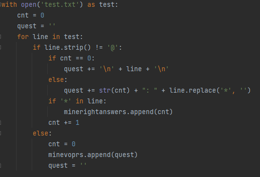
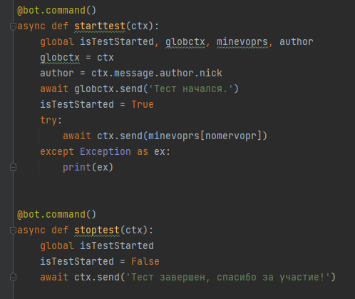
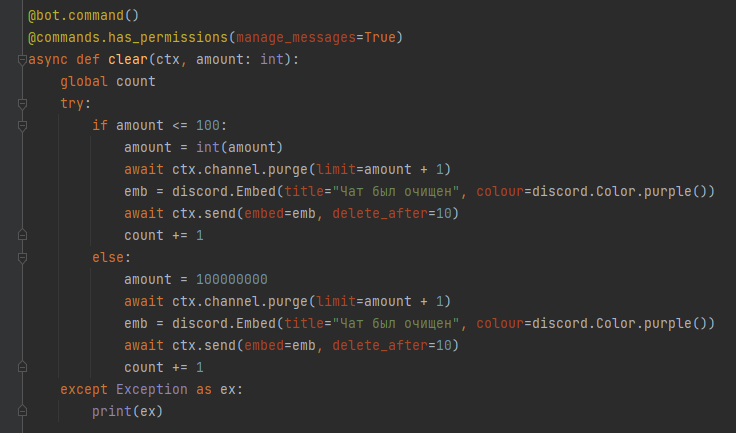
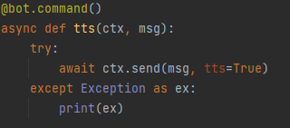

**Он умеет делать практически все:**

**От приветствия, до кика игрока с сервера!**

**Кстати о приветствии, вот код)**

**Рассмотрим его поподробнее:**

**Например возьмем комманду для первого теста, она совсем простая:**

**Сначала открываем файл:**

**а потом и сама программа:**

**А сейчас покажу команду, которая очищает чат, эта команда %clear:**

**она очищает чат на заданное количество сообщений.**

**А теперь комманда tts, в ее аргументе нужно прописать сообщение которое вы собираетесь сказать.**

**Вообщем, я спойлерить пока до конца не буду, но учтите, 
зайти можно по этой ссылке (https://discord.gg/BtqZkKuzuk), посмотреть комманды можно при 
помощи команды %help, а что значит эта комманда можно посмотреть 
при помощи команды %help_po_db название команды.**

